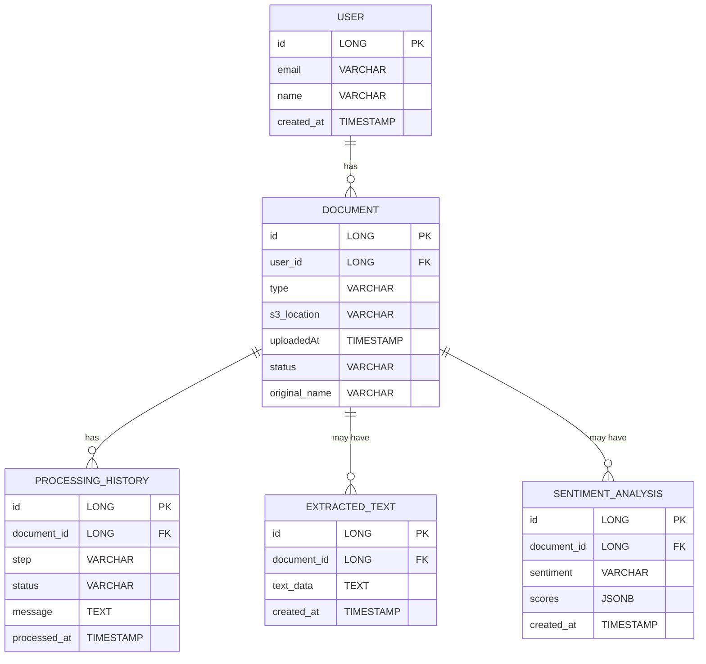

## Diagram (Mermaid)

```mermaid
erDiagram
    USER {
        id LONG PK
        email VARCHAR
        name VARCHAR
        created_at TIMESTAMP
    }
    DOCUMENT {
        id LONG PK
        user_id LONG FK
        type VARCHAR
        s3_location VARCHAR
        uploadedAt TIMESTAMP
        status VARCHAR
        original_name VARCHAR
    }
    PROCESSING_HISTORY {
        id LONG PK
        document_id LONG FK
        step VARCHAR
        status VARCHAR
        message TEXT
        processed_at TIMESTAMP
    }
    EXTRACTED_TEXT {
        id LONG PK
        document_id LONG FK
        text_data TEXT
        created_at TIMESTAMP
    }

    SENTIMENT_ANALYSIS {
        id LONG PK
        document_id LONG FK
        sentiment VARCHAR
        scores JSONB
        created_at TIMESTAMP
    }

    USER ||--o{ DOCUMENT: "has"
    DOCUMENT ||--o{ PROCESSING_HISTORY: "has"
    DOCUMENT ||--o{ EXTRACTED_TEXT: "may have"
    DOCUMENT ||--o{ SENTIMENT_ANALYSIS: "may have"
```
