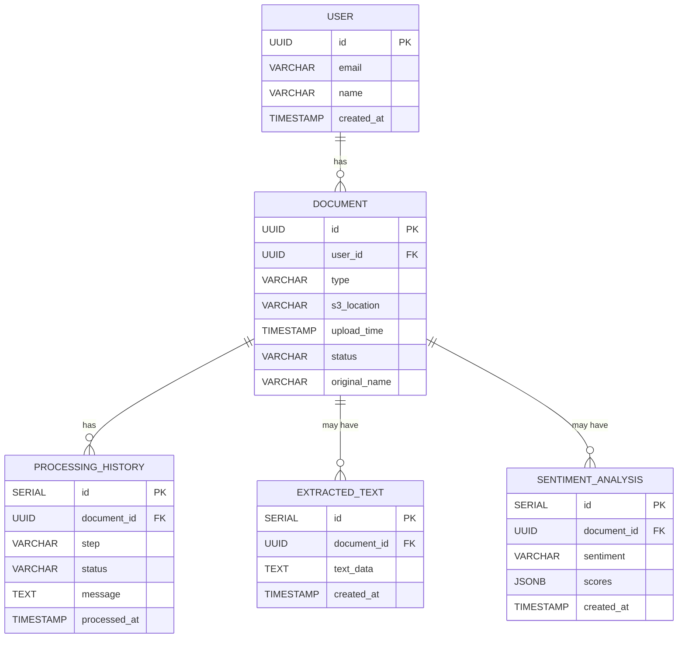

### 1. User

| Column     | Type      | Constraints      |
|------------|-----------|------------------|
| id         | UUID (PK) | PRIMARY KEY      |
| email      | VARCHAR   | UNIQUE, NOT NULL |
| name       | VARCHAR   |                  |
| created_at | TIMESTAMP | DEFAULT now()    |

---

### 2. Document

| Column        | Type      | Constraints                     |
|---------------|-----------|---------------------------------|
| id            | UUID (PK) | PRIMARY KEY                     |
| user_id       | UUID      | FOREIGN KEY REFERENCES User(id) |
| type          | VARCHAR   | NOT NULL ('pdf', 'image', etc)  |
| s3_location   | VARCHAR   | NOT NULL                        |
| upload_time   | TIMESTAMP | DEFAULT now()                   |
| status        | VARCHAR   | NOT NULL                        |
| original_name | VARCHAR   |                                 |

---

### 3. ProcessingHistory

| Column       | Type        | Constraints                                  |
|--------------|-------------|----------------------------------------------|
| id           | SERIAL (PK) | PRIMARY KEY                                  |
| document_id  | UUID        | FOREIGN KEY REFERENCES Document(id)          |
| step         | VARCHAR     | NOT NULL ('uploaded', 'text_extracted', etc) |
| status       | VARCHAR     | NOT NULL ('success', 'failed')               |
| message      | TEXT        |                                              |
| processed_at | TIMESTAMP   | DEFAULT now()                                |

---

### 4. ExtractedText

| Column      | Type        | Constraints                         |
|-------------|-------------|-------------------------------------|
| id          | SERIAL (PK) | PRIMARY KEY                         |
| document_id | UUID        | FOREIGN KEY REFERENCES Document(id) |
| text_data   | TEXT        |                                     |
| created_at  | TIMESTAMP   | DEFAULT now()                       |

---

### 6. SentimentAnalysis

| Column      | Type        | Constraints                         |
|-------------|-------------|-------------------------------------|
| id          | SERIAL (PK) | PRIMARY KEY                         |
| document_id | UUID        | FOREIGN KEY REFERENCES Document(id) |
| sentiment   | VARCHAR     | ('POSITIVE', 'NEGATIVE', etc)       |
| scores      | JSONB       | (e.g., {"Positive": 0.95, ...})     |
| created_at  | TIMESTAMP   | DEFAULT now()                       |

---

## Diagram (Mermaid)

